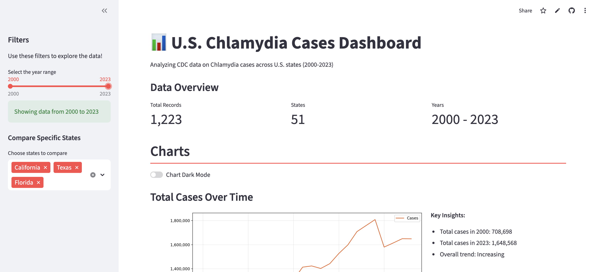

# std-trend-dashboard

# U.S. STD Cases Dashboard

An interactive web dashboard analyzing CDC data on CHlamydia cases across the U.S. from 2000-2023.

🔗 **[Live Dashboard] (https://std-trend-dashboard.streamlit.app/)**

## Project Overview

This project explores std data from from CDC Wonder across the 50 states (and D.C) over the last 23 years. The dashboard allows you to:

- Visualize case trends over time
- Compare rates across states
- Identify geograhpic hotspots
- Filter data by year range

## Tech Stack

- **Python** - Data processing and analysis
- **Pandas** - Data manipulation
- **Matplotlib** - Data visualization
- **Plotly** - Interactive charts and maps
- **Streamlit** - Web dashboard framework

## Key Features

### 1. Analysis of Cases Over Time

Track total cases across the U.S. from 2000-2023, identifying trends and patterns.

### 2. Geographic Visualization

Interactive choropleth map showing case rates per 100,000 population by state.

### 3. State Comparison

Compare 2 or more states side-by-side to see regional differences.

### 4. Interactive Filters

Year range slider to focus analysis on specific time periods.

## Project Structure

std-dashboard/
├── data/
│ ├── raw/ # Original data
│ └── cleaned/ # Processed data
├── notebooks/
│ └── 01_exploration.ipynb # Data exploration and cleaning
├── app.py # Streamlit dashboard
├── requirements.txt # Python dependencies
└── README.md

## Setup to Run locally

# Clone the repository

git clone https://github.com/yourusername/std-dashboard.git
cd std-dashboard

# Install dependencies

pip install -r requirements.txt

# Run the dashboard

streamlit run app.py

Data sourced from [CDC WONDER](https://wonder.cdc.gov/) - National Notifiable Diseases Surveillance System (NNDSS).

## What I Learned

- Cleaning and processing real-world public health data
- Building interactive data visualizations
- Creating deployable web applications with Streamlit
- Working with geographic data and choropleth maps

## Future Improvements

- [ ] Compare with other STDs (Gonorrhea, Syphilis)
- [ ] Include demographic breakdowns (age, gender)
- [ ] Add predictive modeling for future case trends
- [ ] Add downloadable data exports
- [ ] Mobile-responsive design improvements

## 👤 Author

Elijah Outlaw - [GitHub](https://github.com/RealOutlawz) | [LinkedIn](https://www.linkedin.com/in/elijah-outlaw/)
